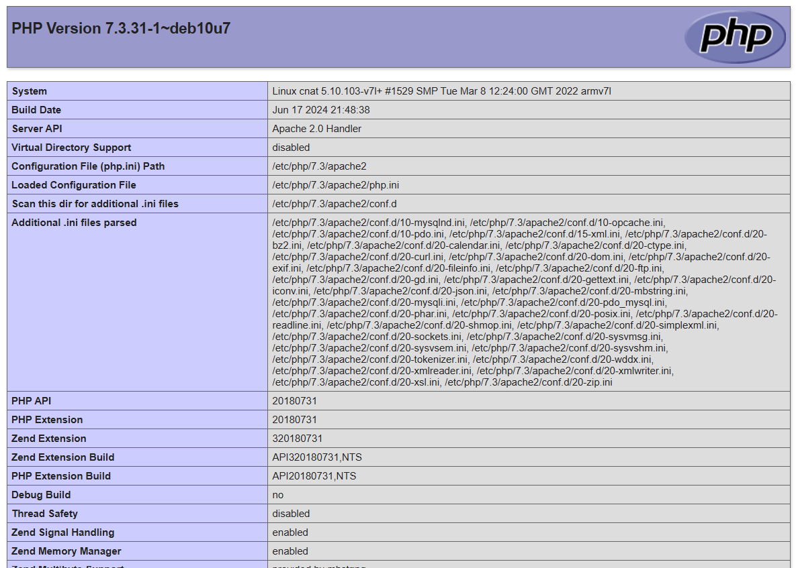

<div align="center">


# SAÉ S5 - Rapport d'installation

<br><br>
Ce document décrit en détail les étapes d'installation<br>
<br>

</div>

<br><br><br><br><br><br><br>

---

## Plan

- ### [I – Présentation](#p1)
    - [**a) Présentation du Cluster**](#p1a)
    - [**b) Présentation du RaspberryPi 4**](#p1b)
    - [**c) Présentation des RaspberryPi Zero**](#p1c)
    

- ### [II – Préparatif](#p2)
    - [**a) Matériels nécessaires**](#p2a)

- ### [III - Installation ](#p3)
    - [**a) Flash des images**](#p3a)
    - [**b) Activation et Connexion au SSH**](#p3b)
    - [**c) Installation de python et ses modules**](#p3c)
    - [**d) Test du module "Nombre premier"**](#p3d)
    - [**Problème d'installation rencontré**](#a-namep3prob-problème-dinstallation-rencontré)

- ### [IV - Mise en place d'une pile LAMP](#p4)

  <br><br><br>

---

## <a name="p1"></a> I - Présentation

- ### <a name="p1a"></a> a) Présentation du Clusterhat

  Le cluster informatique est un ensemble d'ordinateurs qui forme des nœuds (chaque machine est un nœud) connectés et travaillant ensemble pour accomplir des tâches telles que des calculs plus efficacement qu'un seul ordinateur. 
  Ces nœuds sont capables de travailler les uns indépendamment des autres également. 

  Un clusterhat est un dispositif matériel qui permet de créer un mini-cluster en connectant plusieurs Raspberry Pi Zero à un Raspberry PI principal. 
  
  Dans le clusterhat, un Raspberry Pi principal gère les quatres autres Raspberry Pi Zero. Cela forme un petit réseau de machines travaillant de manière coordonnée. 
  
  <br><br>
  **Sources :**
    - https://www.gestionprojet.org/quel-est-le-principe-d-un-cluster-informatique/ 
    - https://www.minimachines.net/actu/clusterhat-raspberry-pi-80208 

- ### <a name="p1b"></a> b) Présentation du RaspberryPi 4
  Le Raspberry Pi 4 est un nano-ordinateur puissant permettant de réaliser des projets informatiques variés.
  
  Informations : 
- Processeur : Quad-core ARM Cortex-A72 (1.5 GHz) => Rapide
- Mémoire RAM : dépend du modèle, mais peut-être 2,4 ou 8 GO
- Ports USB : 2 ports USB 3.0 et 2 ports USB 2.0
- Nombre de cœurs : 4 cœurs 

- ### <a name="p1c"></a> c) Présentation des RaspberryPi Zero
  Le Raspberry Pi Zero est un modèle plus petit et plus léger du Raspberry PI. Il est beaucoup moins puissant que le Raspberry PI Zero mais moins coûteux. 

  Informations : 
- Processeur : Single-core ARM1176JZF-S (1 GHz) → Plus lent que le RPI4
- Mémoire RAM : 512 MO
- Ports USB : 1 port micro-USB 
- Nombre de cœurs : 1

---

## <a name="p2"></a> II - Préparatif

- ### <a name="p2a"></a> a) Matériels nécessaires


Le matériel nécessaire nous a été fourni par Monsieur Hoguin et est constitué des éléments suivants : 

  * Câble HDMI &rarr; Fait la connexion entre l'écran et le raspberry Pi 4
  * Adapteur HDMI-VGA &rarr; Fait la connexion entre l'écran et le raspberry Pi 4
  * Adaptateur microHDMI &rarr; Pour permettre la connexion entre l'adaptateur HDMI-VGA et le RPI4
  * Raspberry Pi 4
  * 4x Raspberry Pi Zero
  * ClusterHat &rarr; Permet la liaison entre lui-même et les RPI0
  * 5x Carte SD &rarr; Permet de flasher les images dessus
  * Câble USB-microUSB &rarr; Permet la liaison entre le RPI4 et le clusterHat
  * Alimentation &rarr; Donné du courant au RaspBerry Pi 4

<br>

## <a name="p3"></a> III - Installation 

Pour l'installation, nous nous sommes principalement appuyé sur la documentation que nous avions sur le site web suivant : 

https://xaviergeerinck.com/2021/01/23/creating-a-raspberry-pi-cluster--1-raspberry-pi---4-pi-zeros--with-cluster-hat/

### <a name="p3a"></a> a) Flash des images

Nous avons commencé par télécharger les images nécessaires au déploiement en accédant aux liens fournis sur le site. Chaque lien 
correspond à une image spécifique, associée à un élement de l'architecture du projet (le premier lien fourni l'image pour le RPi4 
et les 4 autres liens sont destinés aux Pi0).
Ces images contiennent les systèmes d'exploitation préconfigurés. 

Pour chaque RaspBerry Pi, il est nécessaire d'avoir une carte DS distincte, car chaque appareil va exécuter un système indépendant.
Nous avons procédé à l'association de chaque carte SD, une carte SD pour le Raspberry Pi 4 et une pour chaque Raspberry Pi Zero. 

Une fois les cartes SD associées à leurs images respectives, en utilisant Pi Imager, nous avons flasher les images. 

<div align="center">

</div>

Dans l'icône *Raspberry Pi Device*, nous avons indiqué le type de matériel cible pour lequel on flashe l'image. 
Pour la première image associée à la première carte SD, nous avons sélectionné *Raspberry Pi 4* et pour les autres *Raspberry Pi Zero*. 

Dans l'icône *operating system,* on a sélectionné l'image du système d'exploitation à flasher sur la carte SD que nous avions téléchargé et dans *Storage,* on a choisi la carte SD. 

Une fois cette étape réalisée, les cartes SD ont été inséré dans le Cluster pour poursuivre le déploiement.

### <a name="p3b"></a> b) Activation et Connexion au SSH 

Pour s'authentifier au Raspberry Pi on a comme information : 

Nom d'utilisateur : pi <br>
Mot de passe : clusterctrl

Pour mettre en marche les Pi Zeros : ```sudo clusterhat on```

Pour les éteindre : ```sudo clusterhat off```

On génère la clé SSH avec la commande suivante : 

`` ssh-keygen -t rsa -b 4093``

Dans un fichier /.ssh/config, nous allons configurer les 4 Raspberry Pi Zero : 

```
Host p1
  HostName 172.19.181.1
  User pi

Host p2
  HostName 172.19.181.2
  User pi

Host p3
  HostName 172.19.181.3
  User pi

Host p4
  HostName 172.19.181.4
  User pi
````
Pour chaque Pi zero, on définit un nom d'alias qui sera utilisé lors de la connexion SSH (p1,p2,p3,p4). On spécifie l'adresse IP de l'hôte distant et enfin, on indique à SSH quel nom d'utilisateur est utilisé lors de la connexion.  

Pour copier la clé publique SSH sur chaque Pi Zero : 

````
cat ~/.ssh/id_rsa.pub | ssh pi@p1 -T "mkdir ~/.ssh && cat > ~/.ssh/authorized_keys"
cat ~/.ssh/id_rsa.pub | ssh pi@p2 -T "mkdir ~/.ssh && cat > ~/.ssh/authorized_keys"
cat ~/.ssh/id_rsa.pub | ssh pi@p3 -T "mkdir ~/.ssh && cat > ~/.ssh/authorized_keys"
cat ~/.ssh/id_rsa.pub | ssh pi@p4 -T "mkdir ~/.ssh && cat > ~/.ssh/authorized_keys"
````

Pour se connecter au premier Raspberry Pi Zero, on peut utiliser maintenant simplement : ``ssh pi@p1``

### <a name="p3c"></a> c) Installation de python et ses modules 

Tout au long des installations, nous avons mis à jour tous les paquets installés : 

``sudo apt update`` puis ``sudo apt upgrade`` pour mettre les nouvelles versions des paquets

Python étant déjà installé par défaut, nous avons par la suite installé pip le gestionnaire de paquets pour python : 

``sudo apt install python3-pip``

Après avoir consulté le module pour obtenir le nombre de nombres premier d'un nombre, nous avons installé les deux logiciels très utilisés dans le cadre du calcul parallèle en Python : MPICH et mpi4py avec la commande : 

``sudo apt install mpich python3-mpi4py``

MPICH est une implémentation du MPI qui est une interface permettant la communication de plusieurs processus entre eux dans un environnement de calcul parallèle et distribué. 

La bibliothèque mpi4py permet d'utiliser MPI dans le script Python

### <a name="p3d"></a> d) Test du module "Nombre premier"

Nous avons commencé par créer sur notre Github un répertoire /src qui contient le fichier zip envoyé par notre client Mr Hoguin pour pouvoir le récupérer plus facilement sur notre architecture et pouvoir le tester. 

Un répertoire *test* a été créé sur notre architecture : ``mkdir test``

Ensuite, une copie du répertoire /src contenant le fichier zip a été effectué dans le répertoire /test sur notre architecture : 

``cp -r /src/cluster-prime-master/ /test/``

Une fois la copie effectuée, nous avons testé le script prime-blinkt.py avec la commande : ``python3 prime-blinkt.py 20``

On obtient le nombre de nombres premiers inférieur à 20. Il y en a 8 (2,3,5,7,11,13,17,19)

### <a name="p3prob"></a> Problème d'installation rencontré

Lors de l’installation du cluster, nous avons rencontré de nombreuses difficultés à effectuer un premier test des images installées, en raison d’un problème avec l’adaptateur VGA. 
Nous avons ainsi passé plus d’une journée à essayer de comprendre l’origine de l’écran noir qui apparaissait après l’image d’initialisation lors du démarrage du Raspberry Pi 4. 
Pensant initialement que le problème provenait des images utilisées, nous avons envisagé que celles-ci, bien qu’obtenues à partir d’un guide en ligne et non via Pi Imager, puissent être corrompues ou incorrectes. 
Cependant, après vérification, il s’est avéré que ces images correspondaient aux mêmes fichiers disponibles sur le site clusterhat.com. 
Finalement, nous avons découvert que la source du problème résidait dans l’adaptateur VGA défectueux. Après avoir remplacé cet adaptateur, nous avons pu avancer dans la configuration.
<br>

Une fois cette étape franchie, nous avons créé un fichier de configuration comme indiqué dans au-dessus, puis généré une clé SSH. Cependant, nous avons rencontré un autre problème, le Raspberry Pi 4 ne parvenait pas à détecter les interfaces USB des Raspberry Pi Zero. 
Nous avons alors suivi plusieurs guides d’installation trouvés en ligne, sans succès.
Enfin, nous sommes tombés sur le guide d'installation qui recommandait d’ajouter un répertoire vide nommé "ssh" à la racine de chaque image après leur installation. 
Après avoir appliqué cette solution, en recréant et en modifiant les images pour inclure ce répertoire, le Raspberry Pi 4 a finalement été capable de détecter les interfaces USB des Raspberry Pi Zero.
<br>

Lorsque on installe une image sur les Raspberry Pi Zero, le service SSH est désactivé par défaut pour des raisons de sécurité.
Si ce service n’est pas activé, le Pi Zero ne peut pas répondre aux requêtes de connexion, que ce soit via USB ou via un réseau. 
En ajoutant un répertoire vide nommé ssh dans à la racine de chaque images, on active automatiquement le service SSH lors du premier démarrage des Raspberry Pi.
Cela semble également déclencher la configuration correcte des interfaces USB, permettant ainsi au Raspberry Pi4 de detecter les Raspberry Pi Zero 
<br>
## <a name="p4"></a> IV - Mise en place d'une pile LAMP 

Cette partie est dédiée à l'installation d'une pile LAMP sur le Raspberry PI.
Une pile LAMP a besoin de Linux, Apache, MariaDB et PHP. Dans notre cas il nous faudra installer Apache, MariaDB et Php, le rpi fonctionnant déjà avec Linux, on va aussi installer PhpMyAdmin.

### <a name="p4a"></a> a) installation et test de Apache2

On commence par installer Apache2 avec la commande suivante : `sudo apt install apache2`. Apache2 va nous permettre de créer un serveur Apache, le serveur est lancé automatiquement une fois l'installation faite.<br>
Pour verifier si le serveur est bien installé, il suffit de s'y connecter en passant par l'adresse IP que l'on obtient avec la commande `ifconfig`. <br>

### <a name="p4b"></a> b) installation de MariaDB

On va maintenant installé MariaDB qui sera notre Système de Gestion de Base de Donnée (ou SGBD), on utilise la commande suivante `sudo apt install mariadb-server`.

Le Login et le mot de passe pour l'interface phpmyadmin est : (root,Fuse_271)

### <a name="p4c"></a> c) installation de PHP

Pour installer PHP on utilise la commande `sudo apt install php`.
On peut afficher une page phpinfo avec le code suivant 
```php
<?php
infophp();
?>
```

on obtient ensuit la page suivante : 
<div align="center">

</div>

### <a name="p4d"></a> d) installation et test de PhpMyAdmin

PhpMyAdmin est une interface pour gérer les SGBD MariaDB ou MySQL.
Pour installer PhpMyAdmin, on va utiliser la commande `sudo apt install phpmyadmin`.<br>
Ensuite on va tester le bon fonctionement de PhpMyAdmin en se connectant au rpi via l'adresse ip et en rajoutant derriere l'adresse ip `/phpmyadmin` (l'adresse internet à rentrer dans notre navigateur est `<adresse ip du rpi>/phpmyadmin`). 

Pour pouvoir y accéder à cette page, il faut d'abord que l'on exécute cette commande pour achever la configuration de PhpMyAdmin : `sudo ln -s /usr/share/phpmyadmin /var/www/html/phpmyadmin`. Faites ensuite un `sudo systemctl restart apache2` par précaution.

Il faut ensuite que l'on change le mot de passe de root. Pour cela, on exécute la commande `sudo mariadb` pour aller dans l'invite de commandes de MariaDB, dans lequel on lance `ALTER USER 'root'@'localhost' IDENTIFIED BY 'nouveau_mot_de_passe';` (remplacez par le mot de passe de votre choix). Vous pouvez ensuite sortir de l'invite de commande avec `exit`.

Si tout fonctionne bien on devrait se trouver sur la page de connection de PhpMyAdmin <br>


### <a name="p4e"></a> e) Installation de la base de données

Maintenant que PhpMyAdmin fonctionne, il ne reste qu'à mettre en place la base de données du site. Voilà un exemple de script pour la générer :

```sql
DROP DATABASE GestionCalculs;
CREATE DATABASE IF NOT EXISTS GestionCalculs;
USE GestionCalculs;

-- Création de la table Utilisateurs
CREATE TABLE Utilisateurs (
    util_id INT AUTO_INCREMENT PRIMARY KEY,
    login VARCHAR(255) NOT NULL,
    mdp VARCHAR(255) NOT NULL,
    admin BOOLEAN NOT NULL DEFAULT FALSE
);

-- Création de la table Programmes
CREATE TABLE Programmes (
    prog_id INT AUTO_INCREMENT PRIMARY KEY,
    nom_programme TEXT NOT NULL,
    chemin_acces TEXT NOT NULL,
    fonction_entree TEXT NOT NULL -- Chemin d'accès à la fonction de lancement
);

-- Création de la table Calculs
CREATE TABLE Calculs (
    calc_id INT AUTO_INCREMENT PRIMARY KEY,
    util_id INT NOT NULL,
    prog_id INT NOT NULL,
    epingle BOOLEAN NOT NULL DEFAULT FALSE,
    entree TEXT,
    sortie TEXT,
    tps_calcul VARCHAR(20), 
    date DATE NOT NULL DEFAULT CURRENT_DATE,
    FOREIGN KEY (util_id) REFERENCES Utilisateurs(util_id)
        ON DELETE CASCADE
        ON UPDATE CASCADE,
    FOREIGN KEY (prog_id) REFERENCES Programmes(prog_id)
        ON UPDATE CASCADE
);

INSERT INTO `Programmes` (`prog_id`, `nom_programme`, `chemin_acces`, `fonction_entree`) 
VALUES (NULL, 'Nombres Premiers', 'src/cluster-prime-master/prime.py', ''), (NULL, 'Monte Carlo', 'src/MPI_MC/MonteCarlo.py', '');
```

(ce script est également trouvable dans le dossier `site/ressources/db.sql`)
