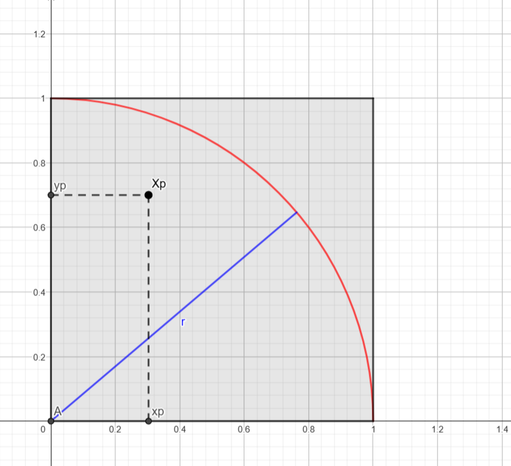

# Algorithme de Monte Carlo avec MPI

## Sommaire :

- ### [MPI (Message Passing Interface)](#p1)
- ### [Algorithme de Monte Carlo](#p2)
- ### [Implémentation de l'algorithme de Monte Carlo en Python avec MPI4PY](#p3)
    - #### [Paradigme Master-Worker](#p3.1)
    - #### [Modèle MPI](#p3.2)
    - #### [Explication du code Python](#p3.3)

## <a name="p1"></a> MPI (Message Passing Interface) :

MPI est une bibliothèque de communication pour les programmes parallèles. Elle permet de créer des programmes parallèles dans lesquels les processus peuvent communiquer entre eux.<br>
Dans une approche de type Master-Worker, le processus **Master** envoie des tâches aux processus **Workers**, qui les exécutent et renvoient les résultats au **Master**.<br>
Pour différencier les processus, MPI attribue un **rank** à chaque processus. Le **Master** a toujours le **rank 0**, et les **Workers** ont des **ranks supérieurs à 0**.<br>

## <a name="p2"></a> Algorithme de Monte Carlo :

La méthode de Monte-Carlo est une méthode probabiliste qui permet d'estimer la valeur de $\pi$. Elle fonctionne de la façon suivante :  

<br>

Soit $A_{1/4d}$ l'aire d'un quart de disque de rayon $1$ :  

$A_{1/4d} = \frac{\pi r^2}{4} = \frac{\pi}{4}$  


Soit $A_c$ l'aire d'un carré de côté $1$ :  

$A_c = 1^2 = 1$  

Soient les points $X_p (x_p, y_p)$ dont les coordonnées sont tirées selon une loi uniforme $M(]0;1[)$.  

<br><small><small>*Graphique représentant une épreuve de Monte-Carlo*</small></small></img>

La probabilité que $X_p$ soit tiré dans le quart de disque est :  

$\boxed{P = \frac{A_{1/4d}}{A_c} = \frac{\pi}{4}}$  

On effectue $n_{\text{tot}}$ tirages aléatoires.  
Soit $n_{\text{cible}}$ le nombre de points tirés dans le quart de disque.  

Si $n_{\text{tot}}$ est grand, alors on peut approximer $P$ par :  
<a name="p2.b"></a>  
$P = \frac{n_{\text{cible}}}{n_{\text{tot}}} \approx \frac{\pi}{4}$  

D'où :  $\boxed{\pi \approx 4 \cdot \frac{n_{\text{cible}}}{n_{\text{tot}}}}$  

<br>

## <a name="p3"></a> Implémentation de l'algorithme de Monte Carlo en Python avec MPI4PY :

Pour réaliser une implémentation de l'algorithme de Monte Carlo en Python avec MPI4PY, on utilise le paradigme de programmation parallèle Master-Worker et le modèle MPI.

### <a name="p3.1"></a> **Paradigme Master-Worker**  
1. **Rôle du processus Master (rank 0)** :  
   - Il participe aux calculs directs et collecte les résultats des processus **Workers**.  
   - Il agit comme un coordinateur pour centraliser les résultats.  

2. **Rôle des processus Workers (rank > 0)** :  
   - Ils effectuent le calcul principal, ici le comptage des points à l'intérieur du cercle unité pour une approximation de $\pi$.  
   - Ils envoient leurs résultats partiels au **Master** via `comm.send`.  

### <a name="p3.2"></a> **Modèle MPI**  
1. **Communications explicites** :  
   - Le code utilise MPI pour la communication entre processus :  
     - `comm.send` : utilisé par les **Workers** pour transmettre leurs résultats partiels au **Master**.  
     - `comm.recv` : utilisé par le **Master** pour recevoir les résultats des **Workers**.  

2. **Parallélisme distribué** :  
   - Chaque processus exécute une partie du calcul indépendamment, ce qui exploite le parallélisme pour accélérer l'approximation de $\pi$.  
   - MPI gère la création des processus et leur communication via `MPI.COMM_WORLD`.  

### <a name="p3.3"></a> **Explication du code Python** :  

Cette partie explique le code Python de l'algorithme de Monte Carlo avec MPI4PY.  

1. **Initialisation MPI** :  
   - Le programme utilise `MPI.COMM_WORLD` pour initialiser un communicateur global permettant la communication entre les différents processus.  
   - Chaque processus récupère son rang (`rank`) et le nombre total de processus (`size`).  

2. **Vérification du rank** :  
   - Si `rank != 0`, alors le processus est un **Worker**, il réalisera les lancés des points et enverra ses résultats au processus **Master**.  
   - Si `rank == 0`, alors le processus est le **Master**, il récupérera les résultats des lancés des processus **Workers** et calculera une valeur approchée de $\pi$.  

3. **Réalisation des épreuves de Monte Carlo** :  
   - Les épreuves de Monte Carlo sont effectuées par les processus **Workers** et le processus **Master** comme évoqué dans [la partie 2](#p2). Le nombre d'épreuves est défini par la variable `numIter`. Pour générer des coordonnées aléatoires, on utilise `random.random()` pour obtenir une valeur entre 0 et 1 pour $x$ et pour $y$.  
   - Une fois les épreuves réalisées, le processus envoie le nombre de points dans le quart de disque au processus **Master** avec `comm.send(cpt, dest=0, tag=rank)`, ici `cpt` représente le nombre de points dans le quart de disque, `dest` représente le `rank` du processus destinataire, et `tag` un tag ajouté au message.  

4. **Récupération des résultats et calcul de $\pi$ (si rank == 0)** :  
   - Le processus **Master** reçoit les résultats des processus **Workers** avec :  
     ```python
     for i in range(1, size):
         partial_cpt = comm.recv(source=i, tag=i)
         total_cpt += partial_cpt
     ```  
   - Les valeurs récupérées sont additionnées dans une variable `total_cpt`.  

   - Une fois tous les résultats récupérés, le processus **Master** calcule une valeur approchée de $\pi$ avec :  
     ```python
     pi = 4 * total_cpt / total_points
     ```  

5. **Affichage des résultats** :  
   Le processus **Master** affiche les résultats avec :  
   ```python
   print(f"Processus : {size}")
   print(f"Points : {total_points}")
   print(f"Pi : {pi}")
   print(f"Erreur : {math.pi - pi}")
   print(f"Temps : {end - start}")
   ```  

## Conclusion :

L'algorithme de Monte Carlo, est efficace pour illustrer des concepts probabilistes, mais n'est pas le meilleur moyen de calculer $\pi$. Cependant, l'objectif principal de cet exercice était de comprendre et de mettre en oeuvre un modèle de communication par message sur un problème de parallélisation. 
Le but de cet exercice est l'apprentissage de la programation parallèle avec MPI. Il permet d'apprendre les notions de communication entre processus.