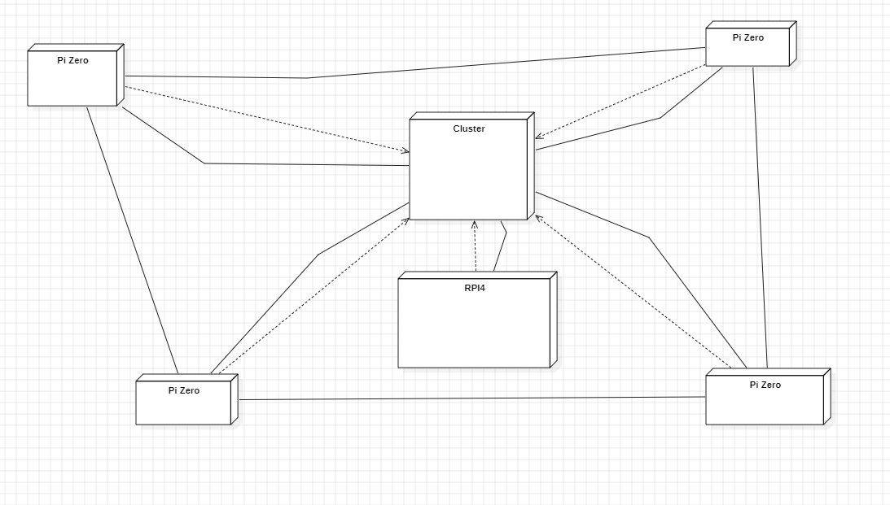

# SAÉ S5  Dossier de conception

       

## Plan

### [I – Conception Architecturale](#p1)
- <b>[Figure 1 : Diagramme de déploiement ](#fg1)</b>

### [II – Conception Détaillée](#p2)

       

------------------------------------------------------------------------------------------------------------------------
## I – Conception Architecturale
 

### Introduction
Ce document expose en détail la mise en œuvre et la conception du projet.
Il explore les différentes perspectives de la structure du projet et les comportements associés à son utilisation.

### Conception Architecturale

<i>Figure 1 : Diagramme de déploiement.</i>

### Explication :

Nous avons choisi de créer un diagramme de déploiement pour cette architecture, car il met en lumière la structure physique et les interactions entre les nœuds. Cela est essentiel pour appréhender le fonctionnement d'une architecture inconnue et jamais utilisée auparavant.
  
Nous avons 6 noeuds représentant les 6 composants que l'on possède : Les 4 PI Zero, le cluster et le RPI4. 
 
Les PI Zero dépendent du cluster hat car c'est lui qui établit la connexion et fournit l'interface pour communiquer avec le RPI4. Cette dépendance est représentée par une flèche discontinue.  
Le cluster hat quant à lui communique directement avec les PI Zero et le RPI4.  
Le RPI4 communique avec les PI Zero indirectement par l'intermédiaire du cluster, c'est pour cela que le cluster est caractérisé comme étant la source de communication et que le RPI4 dépend de lui.
------------------------------------------------------------------------------------------------------------------------
### I – Conception Détaillée

