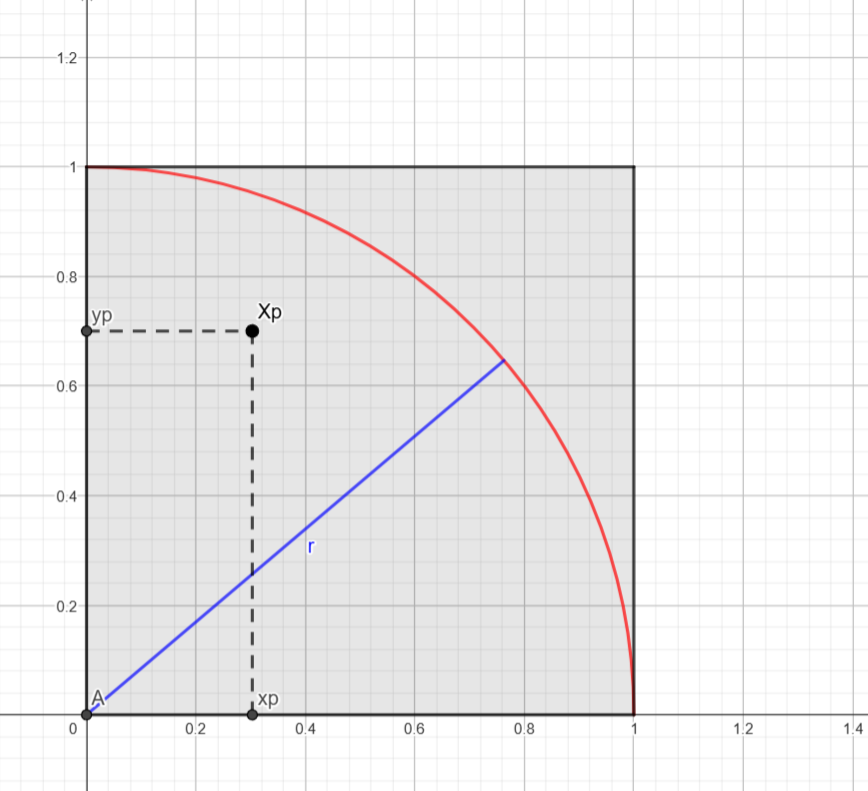

# Rapport de performance

---

**Rédigé par :** Loan Quillet
**Le :** 21/01/2025
**Version :** 1.0

---

## Introduction

L'objectif de ce rapport est d'évaluer la performance de deux codes parallèles exécutés sur un cluster, en se concentrant sur leur scalabilité. La scalabilité est mesurée à travers le *speedup*, une métrique qui compare le temps d'exécution en mode séquentiel à celui en mode parallèle. Deux types de scalabilité sont analysés :
- **Scalabilité forte** : Observer l'évolution des performances en augmentant le nombre de ressources parallèles pour un problème de taille fixe.
- **Scalabilité faible** : Étudier les performances lorsque la taille du problème augmente proportionnellement au nombre de ressources.

Le *speedup* est défini mathématiquement comme suit :  
$$\text{Speedup} = \frac{T_{\text{séquentiel}}}{T_{\text{parallèle}}}$$
où $T_{\text{séquentiel}}$ représente le temps d'exécution du code en mode séquentiel et $T_{\text{parallèle}}$ le temps d'exécution en mode parallèle pour un même problème. Un *speedup* idéal serait égal au nombre de ressources parallèles utilisées, bien que des facteurs tels que la communication entre nœuds ou les parties non parallélisables du code puissent limiter ce résultat.

Les deux codes étudiés dans ce rapport remplissent des objectifs distincts :
- **Cluster Prime** : Un algorithme qui identifie tous les nombres premiers inférieurs à une valeur donnée.
- **MPI Monte-Carlo** : Un programme qui estime la valeur de Pi en utilisant la méthode Monte Carlo.

Ces différences fondamentales dans leurs fonctions et leurs approches impliquent que leurs performances ne peuvent pas être comparées directement. Ainsi, chaque code est analysé séparément, avec une attention particulière portée à leur logique de parallélisation et à leurs résultats.

Pour exécuter et mesurer les performances des deux codes, un script Python nommé `Executor.py` a été développé. Ce script automatise le lancement des tests sur le cluster à l'aide de la commande `mpirun`, permettant de spécifier le nombre de processeurs à utiliser. Il capture également la sortie des programmes pour qu'on puisse les analyser dans ce document.

Le script est conçu pour mesurer à la fois la **scalabilité forte** et la **scalabilité faible**, en modifiant les paramètres de taille du problème ou du nombre de processeurs selon le type d'évaluation. Les résultats des tests sont ensuite stockés dans des fichiers CSV pour faciliter leur exploitation. Cette approche garantit une collecte systématique et reproductible des données nécessaires à l'analyse des performances.

Cette précision étant faite, ce rapport est structuré pour présenter, pour chaque code, une description, la méthodologie d'évaluation et une analyse détaillée des résultats obtenus. Une conclusion générale synthétisera les observations et proposera des pistes pour d'éventuelles optimisations.  

## Analyse du Code 1 : Cluster Prime

### Description du code

Ce code vise à trouver tous les nombres premiers inférieurs à une limite spécifiée, en utilisant une approche parallèle avec le module **MPI (Message Passing Interface)** via la bibliothèque Python `mpi4py`. L'objectif est de diviser le travail entre plusieurs processus pour accélérer la recherche des nombres premiers.

#### Fonctionnement général
1. **Initialisation MPI** :
    - Le code s'attache au communicateur global `COMM_WORLD` pour accéder aux fonctionnalités MPI.
    - Chaque processus obtient un identifiant unique (`my_rank`) et le nombre total de processus participant au calcul (`cluster_size`).

2. **Division du travail** :
    - Chaque processus se voit assigner un point de départ distinct, calculé en fonction de son rang (`my_rank`) et d'un pas qui dépend du nombre total de processus (`cluster_size`).
    - Les nombres candidats à tester sont répartis de manière à ce qu'il n'y ait pas de chevauchement entre les processus.

3. **Vérification de la primalité** :
    - Chaque processus teste si ses nombres candidats sont premiers, en vérifiant s'ils sont divisibles par un nombre inférieur à eux-mêmes (à partir de 2).
    - Les nombres identifiés comme premiers sont ajoutés à une liste locale.

4. **Communication des résultats** :
    - Les listes locales de nombres premiers de chaque processus sont rassemblées sur le processus maître (`rank 0`) à l'aide de la fonction `comm.gather()`.

5. **Fusion des résultats** :
    - Le processus maître fusionne et trie les listes locales pour obtenir une liste complète des nombres premiers.
    - Les résultats finaux incluent le nombre total de nombres premiers trouvés, la liste des nombres premiers et le temps d'exécution total.

#### Paramètres du programme
- **Argument en ligne de commande** :  
  Le programme prend un argument `end_number`, qui définit la limite supérieure pour la recherche des nombres premiers.

- **Variables importantes** :
    - `start_number` : Point de départ du processus, dépendant du rang.
    - `cluster_size` : Nombre total de processus participant au calcul.
    - `candidate_number` : Nombres candidats à vérifier pour la primalité.

#### Sortie du programme
Le résultat final est affiché par le processus maître sous la forme d'un objet JSON contenant :
- `value` : Le nombre total de nombres premiers trouvés.
- `liste` : La liste des nombres premiers.
- `temps` : Le temps total d'exécution.
- `size` : Le nombre de processus utilisés.

### Méthodologie d’évaluation

Pour évaluer la scalabilité du code de recherche de nombres premiers, nous avons testé différentes configurations de **workers** (de 1 à 4) tout en maintenant une taille de problème fixe à **60000**.

#### Configuration des tests

**Scalabilité forte :**

| Id test | Nb Worker | Taille | Taille / Worker | Itérations |
|---------|-----------|--------|-----------------|------------|
| 1       | 1         | 60000  | 60000           | 50         |
| 2       | 2         | 60000  | 30000           | 50         |
| 3       | 3         | 60000  | 15000           | 50         |
| 4       | 4         | 60000  | 7500            | 50         |

**Scalabilité faible :**

| Id test | Nb Worker | Taille | Taille / Worker | Itérations |
|---------|-----------|--------|-----------------|------------|
| 1       | 1         | 60000  | 60000           | 50         |
| 2       | 2         | 120000 | 60000           | 50         |
| 3       | 3         | 180000 | 60000           | 50         |
| 4       | 4         | 240000 | 60000           | 50         |

### Résultats et Analyses

#### Scalabilité forte

- **Points optimaux** : Les premiers points (1 et 2 workers) se situent sur la **courbe optimale de speedup**, indiquant une **augmentation proportionnelle du speedup** avec l'ajout de workers.
- **Point sous-optimal** : Le troisième point (avec 3 workers) se trouve à la même hauteur que le point 2, mais avec un nombre plus élevé de workers. Cela indique une **utilisation sous-optimale des ressources** et une **diminution de l'efficacité** du parallélisme à partir de ce nombre de workers.
- **Point en remontée** : Le quatrième point, représentant 4 workers, remonte par rapport au troisième, mais ne parvient pas à rejoindre la courbe optimale, indiquant une amélioration partielle de la performance. Toutefois, le **speedup reste sous-optimal**, ce qui suggère que l'ajout d'un quatrième worker ne génère pas de gains significatifs.

Les résultats de la scalabilité forte montrent une **performance relativement bonne** avec 2 à 3 workers, mais l'efficacité commence à se dégrader au-delà de ce point, ce qui reflète une **scalabilité forte sous-optimale**.

#### Scalabilité faible

- **Tendance générale** : La courbe présente une **diminution constante** du speedup à mesure que la taille du problème augmente.
- **Stabilisation** : À partir du troisième point (taille 180000), la courbe semble **se stabiliser**, mais à un niveau **très bas** et **sous-optimal**, ce qui indique que l'augmentation de la taille du problème a un impact négatif sur les performances.

Ces résultats suggèrent que, même si le programme bénéficie de l'ajout de workers pour des tailles de problèmes plus petites, l'augmentation de la taille du problème avec un nombre fixe de workers n'optimise pas la performance. Cette situation reflète une **scalabilité faible sous-optimale**.

### Synthèse

L'analyse des résultats pour le code de recherche de nombres premiers met en évidence une scalabilité **sous-optimale**, tant en termes de scalabilité faible que forte.

#### Scalabilité faible
La courbe de scalabilité faible montre que l'augmentation de la taille du problème (de 60000 à 240000) a un impact négatif sur la performance. Les résultats deviennent de plus en plus sous-optimaux à mesure que la taille du problème augmente, avec une stabilisation à un niveau très bas à partir de la taille 180000. Cela suggère que, bien que le code puisse gérer de petites tailles de problème efficacement, il n'est pas bien adapté pour gérer de grandes tailles de données avec une augmentation du nombre de workers.

#### Scalabilité forte
En ce qui concerne la scalabilité forte, les premiers résultats avec 1 et 2 workers montrent des performances proches de l'optimal, mais dès que le nombre de workers atteint 3, l'efficacité commence à diminuer. Le speedup reste sous-optimal, même avec 4 workers, ce qui indique que le programme atteint un **plafond de performance** au-delà de 2-3 workers. Cela suggère que la parallélisation n'est pas pleinement exploitée et que des gains de performance sont limités au-delà d'un certain point.

En conclusion, le code montre une bonne capacité à tirer parti du parallélisme pour des petites tailles de problèmes, mais il présente des limites évidentes lorsque l'on tente d'augmenter la taille du problème ou le nombre de workers. Les résultats indiquent qu'il existe un **plafond de performance** au-delà duquel l'ajout de plus de ressources n'apporte pas de bénéfices significatifs.

## Analyse du Code 1.5 : Prime Plus

### Description du code

Le code **Prime Plus** est une version améliorée du programme de recherche de nombres premiers, qui intègre une optimisation dans l’algorithme de recherche. Voici les principales modifications/optimisations :

#### 1. Optimisation de l'Algorithme
L'une des améliorations notables de **Prime Plus** est l'optimisation de l'algorithme de recherche de nombres premiers :
- **Algorithme de division** : Au lieu de vérifier tous les diviseurs d'un nombre jusqu'à `candidate_number - 1`, **Prime Plus** se limite à tester les diviseurs jusqu'à `sqrt(candidate_number)` (la racine carrée de `candidate_number`), ce qui permet de réduire considérablement le nombre de vérifications pour chaque nombre candidat.

#### 2. Calcul du Temps d'Exécution
Le temps d’exécution est mesuré avec une précision accrue, en millisecondes, afin de mieux évaluer les performances du code dans des configurations parallèles.

#### 3. Collecte et Fusion des Résultats
Chaque worker accumule les nombres premiers qu'il découvre et les envoie au processus principal (rank 0) à l’aide de la fonction `comm.gather()`. Ensuite, les résultats de tous les processus sont fusionnés dans une liste, triés, puis affichés.

### Méthodologie d’évaluation

La méthodologie d’évaluation pour le **code Prime Plus** est très similaire à celle utilisée pour le premier code, à la différence que cette fois-ci, nous avons travaillé avec un problème de taille plus grande, c'est-à-dire un **maximum de 1 200 000** (au lieu de 60 000). 

#### Configuration des tests

**Scalabilité forte**

| Id test | Nb Worker | Taille  | Taille / Worker | Itérations |
|---------|-----------|---------|-----------------|------------|
| 1       | 1         | 1200000 | 1200000         | 50         |
| 2       | 2         | 1200000 | 600000          | 50         |
| 3       | 3         | 1200000 | 300000          | 50         |
| 4       | 4         | 1200000 | 150000          | 50         |

**Scalabilité faible**

| Id test | Nb Worker | Taille  | Taille / Worker | Itérations |
|---------|-----------|---------|-----------------|------------|
| 1       | 1         | 1200000 | 1200000         | 50         |
| 2       | 2         | 2400000 | 1200000         | 50         |
| 3       | 3         | 3600000 | 1200000         | 50         |
| 4       | 4         | 4800000 | 1200000         | 50         |

### Résultats et Analyse

#### Scalabilité forte

Les résultats de la **scalabilité forte** pour le **code Prime Plus** sont exactement les mêmes que ceux du premier code.

#### Scalabilité faible

La **scalabilité faible** présente également un comportement similaire à celui observé pour le premier code.

### Synthèse

Le **code Prime Plus** apporte une amélioration notable par rapport au premier code **Prime**. En optimisant l'algorithme de recherche de nombres premiers en ne testant que jusqu'à la racine carrée du candidat, ce nouveau code réduit significativement le nombre d'opérations nécessaires pour vérifier la primalité, ce qui peut offrir des gains en termes de performance, surtout pour des tailles de problème plus grandes.

Cependant, en dépit de cette optimisation, les résultats obtenus en termes de **scalabilité forte** et **faible** montrent que les limites du système restent similaires à celles du premier code. Les performances ne parviennent pas à atteindre la courbe optimale de **speedup** et le système commence à souffrir de sous-optimalité à partir d'un certain nombre de workers.

Cela nous suggère donc que le problème ne vient peut-être pas de l'efficacité du code, mais bien de sa méthode.

En conclusion, bien que le **code Prime Plus** améliore l'efficacité de la recherche des nombres premiers grâce à l'optimisation de l'algorithme, il demeure affecté par les mêmes limitations observées pour le premier code, notamment la difficulté à obtenir une scalabilité optimale avec l'augmentation du nombre de workers et de la taille du problème.

## Analyse du Code 2 : MPI Monte-Carlo

### Description du code

Ce programme utilise l'algorithme de Monte-Carlo pour estimer la valeur de **Pi** en parallélisant le calcul avec **MPI**. 

#### La Méthode de Monte-Carlo

La méthode de Monte Carlo repose sur une estimation probabiliste pour approximer π à partir de tirages aléatoires.

Soit $A_{\text{quartD}}$ l’aire d’un quart de disque de rayon $r = 1$ :  
$$A_{\text{quartD}} = \frac{\pi r^2}{4} = \frac{\pi}{4}$$

Le quart de disque est inscrit dans un carré de côté $r = 1$, dont l’aire est :  
$$A_c = r^2 = 1$$

On considère un point $X_p(x_p, y_p)$ généré aléatoirement dans ce carré, où $x_p$ et $y_p$ suivent la loi uniforme $U(]0,1[)$.

La probabilité que $X_p$ appartienne au quart de disque est donnée par :  
$$P = \frac{A_{\text{quartD}}}{A_c} = \frac{\pi}{4}$$

Pour estimer cette probabilité, on effectue $n_{\text{tot}}$ tirages aléatoires. Soit $n_{\text{cible}}$ le nombre de points qui satisfont la condition $x_p^2 + y_p^2 \leq 1$, c’est-à-dire les points situés dans le quart de disque.

Si $n_{\text{tot}}$ est suffisamment grand, par la loi des grands nombres, la fréquence observée $n_{\text{cible}} / n_{\text{tot}}$ converge vers la probabilité $P$, soit :  
$$P = \frac{n_{\text{cible}}}{n_{\text{tot}}} \approx \frac{\pi}{4}$$

On peut ainsi en déduire une approximation de π :  
$$\pi \approx 4 \cdot \frac{n_{\text{cible}}}{n_{\text{tot}}}$$

Ainsi, plus $n_{\text{tot}}$ augmente, plus l'estimation de π se précise.

#### Le programme utilisé

Voici les étapes principales :

1. **Initialisation** :
    - Chaque processus obtient son rang (**`rank`**) et le nombre total de processus (**`size`**).
    - Le travail est divisé : chaque processus génère une fraction des points aléatoires définie par l'argument d'entrée divisé par **`size`**.

2. **Calcul local** :
    - Chaque processus génère des points aléatoires $(x, y)$ dans le carré unité $[0,1] × [0,1]$.
    - Il compte les points qui tombent à l’intérieur du cercle unité ($x^2 + y^2 \leq 1$) dans un compteur local (**`cpt`**).

3. **Communication et agrégation** :
    - Les processus esclaves envoient leur résultat au maître (rang 0).
    - Le maître agrège les résultats, calcule une estimation de **Pi** ($\pi \approx 4 \cdot \frac{\text{points\_dans\_cercle}}{\text{points\_totaux}}$), mesure le temps total, et détermine l'erreur absolue par rapport à la valeur réelle de Pi.

4. **Résultats** :
    - Le maître génère un rapport JSON contenant :
        - La valeur estimée de **Pi**,
        - L'erreur absolue,
        - Le temps total d’exécution.

Ce programme est efficace et bien adapté à la parallélisation grâce à la nature indépendante des calculs sur chaque processus.

### Méthodologie d’évaluation

Pour évaluer les performances du programme Monte-Carlo, nous avons suivi une méthodologie similaire à celle utilisée pour les deux précédents codes. Les tests ont été réalisés en faisant varier le **nombre de processus (workers)** tout en fixant la **taille totale du problème** à **12 000 000 points**. Chaque configuration a été testée plusieurs fois pour assurer la robustesse des mesures.

#### Configuration des tests

**Scalabilité forte**

| Id test | Nb Worker | Taille   | Taille / Worker | Itérations |
|---------|-----------|----------|-----------------|------------|
| 1       | 1         | 12000000 | 12000000        | 50         |
| 2       | 2         | 12000000 | 6000000         | 50         |
| 3       | 3         | 12000000 | 3000000         | 50         |
| 4       | 4         | 12000000 | 1500000         | 50         |

**Scalabilité faible**

| Id test | Nb Worker | Taille   | Taille / Worker | Itérations |
|---------|-----------|----------|-----------------|------------|
| 1       | 1         | 12000000 | 12000000        | 50         |
| 2       | 2         | 24000000 | 12000000        | 50         |
| 3       | 3         | 36000000 | 12000000        | 50         |
| 4       | 4         | 48000000 | 12000000        | 50         |

### Résultats et Analyse

#### Scalabilité forte

Le graphique de **scalabilité forte** montre que le programme Monte-Carlo offre une excellente performance en parallèle. La courbe de **speedup** est presque parfaitement alignée avec la courbe optimale pour les trois premières configurations de workers. Ce n’est qu’à partir du quatrième point que la courbe commence à s’éloigner, mais semble garder une certaine croissance.

Cette performance met en évidence l’efficacité du programme pour répartir la charge de calcul entre les processus, minimisant les pertes dues aux communications ou à d’autres goulots d’étranglement.

#### Scalabilité faible

Le graphique de **scalabilité faible** présente une tendance similaire : la courbe suit de très près l’optimale pour toutes les configurations de workers excepté la troisième, à partir de laquelle elle commence à chuter doucement. Cela indique que le programme est capable d’augmenter efficacement sa capacité de calcul en fonction du nombre de processus, même lorsque la taille totale du problème augmente proportionnellement.

### Synthèse

Le programme Monte-Carlo se distingue par une très bonne **scalabilité forte** comme **faible**. En effet, les courbes de **speedup** observées sont presque idéales dans les deux configurations, indiquant que l’algorithme tire pleinement parti des capacités de parallélisation offertes par le cluster.

Cette performance est directement liée à la nature de l’algorithme : les calculs pour chaque point dans la méthode Monte-Carlo sont totalement **indépendants**, ce qui minimise les besoins de communication entre les processus. Ainsi, même avec un grand nombre de workers ou une augmentation significative de la taille du problème, le programme conserve une efficacité **quasi** optimale.

Les écarts mineurs observés par rapport à la courbe optimale, bien que perceptibles, n’entachent pas la qualité générale du programme. Cela en fait un excellent candidat pour des calculs massivement parallèles nécessitant une approche simple et efficace.

## Conclusion Générale

Ce rapport a exploré la performance et la scalabilité de trois codes parallèles : **Prime**, **Prime Plus**, et **Monte-Carlo**, chacun implémentant des approches différentes pour résoudre des problèmes spécifiques. Les analyses effectuées permettent de tirer plusieurs conclusions sur leur comportement en environnement parallèle.

### Synthèse des observations
- **Prime et Prime Plus :**  
  Ces deux codes, bien qu’ayant le même objectif (trouver les nombres premiers en dessous d’une limite donnée), ont montré des différences significatives en termes de scalabilité.
   - **Prime** présente une scalabilité forte et faible médiocre, particulièrement pénalisée par la répartition sous-optimale des calculs et une complexité inutile dans les vérifications de primalité.
   - **Prime Plus**, en revanche, apporte une amélioration en réduisant cette complexité en ne testant les divisions que jusqu’à la racine carrée des candidats. Bien que cela ait permis une amélioration des performances, cette amélioration n'a pas suffit à améliorer la scalabilité, peut-être dû aux besoins élevés de communication.

- **Monte-Carlo :**  
  Ce programme a démontré une scalabilité exceptionnelle, avec des courbes de speedup quasi idéales. L’indépendance totale des calculs entre les processus, combinée à une charge de communication minimale, en fait un bon exemple d’algorithme massivement parallélisable.

### Suggestions pour des travaux futurs
- **Optimisations algorithmiques :**  
  Pour les codes Prime et Prime Plus, des stratégies supplémentaires pourraient être explorées, telles que l’utilisation d’algorithmes plus avancés pour la recherche de nombres premiers, comme le crible d’Erathosthène parallèle, qui pourrait réduire significativement les coûts computationnels.
   - De plus, un équilibrage plus fin de la charge entre les processus (par exemple, une répartition dynamique des tâches) pourrait améliorer les performances en mode faible.

- **Approfondissement pour Monte-Carlo :**  
  Bien que performant, Monte-Carlo pourrait encore bénéficier d’optimisations en termes d’utilisation de la mémoire ou en réduisant davantage les communications nécessaires pour la collecte des résultats finaux.

- **Exploration de nouveaux cas d’usage :**  
  Tester ces codes sur des clusters de plus grande taille ou dans des environnements hétérogènes permettrait de mieux comprendre leurs limites et leur comportement à échelle accrue.

### Conclusion finale
Les résultats obtenus mettent en lumière l’importance de concevoir des algorithmes adaptés à la parallélisation dès leur conception. Si Monte-Carlo illustre parfaitement les bénéfices d’une indépendance des tâches, les codes Prime montrent que des optimisations algorithmiques peuvent améliorer les performances mais restent limitées par des aspects structurels. Ces observations offrent des pistes claires pour des travaux futurs et contribuent à enrichir la compréhension des principes de scalabilité dans les environnements de calcul parallèle.
