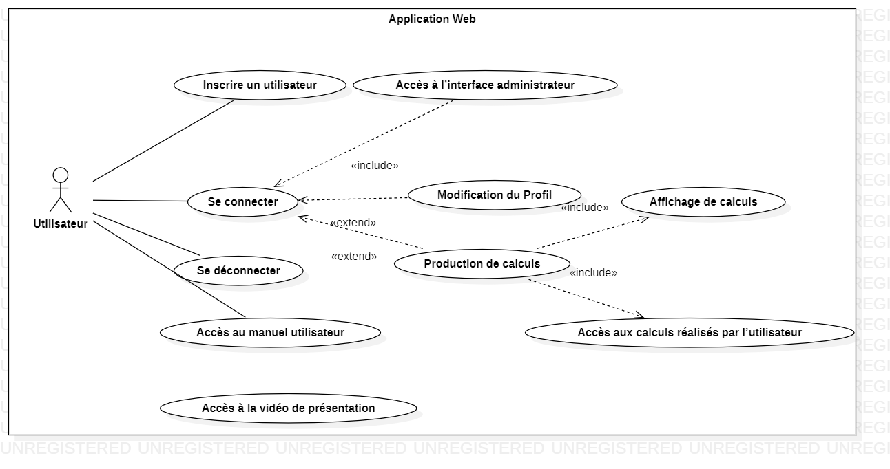

# SAÉ S5 - Recueil des besoins

  
Ce document rassemble toutes les informations importantes que nous devrons respecter pour mener à bien ce projet.

       

## Plan

### [I – Objectif et portée](#p1)
- <b>[a) Quels sont la portée et les objectifs généraux ?](#p1a)</b>
- <b>[b) Lecture du cahier des charges](#p1b) </b>
    - <u>[i. Liste des objets, acteurs et actions](#p1bi) </u>
    - <u>[ii. Les différents niveaux](#p1bii) </u>
    - <u>[iii. Un schéma descriptif des niveaux](#p1biii) </u>
    - <u>[iiii. Le diagramme des cas d'utilisation](#p1biiii) </u>
### [II – Terminologie employée / Glossaire](#p2)
### [III – Les cas d’utilisation](#p3)
- <b>[a) Les acteurs principaux et leurs objectifs généraux](#p3a).</b>
- <b>[b) Les cas d’utilisation métier (concepts opérationnels).](#p3b)</b>
- <b>[c) Les cas d’utilisation stratégique.](#p3c)</b>
- <b>[d) Les cas d’utilisation utilisateur et système.](#p3d)</b>
### [IV – La technologie employée](#p4)
- <b>[a) Quelles sont les exigences technologiques pour ce système ?](#p4a)</b>
- <b>[b) Avec quels systèmes ce système s’interfacera-t-il et avec quelles exigences ?](#p4b)</b>
### [V – Autres exigences](#p5)
- <b>[a) Processus de développement](#p5a)</b>
    - <u>[i. Qui sont les participants au projet ?](#p5ai)</u>
    - <u>[ii. Quelles valeurs devront être privilégiées ? (exemple : simplicité, disponibilité, rapi-
      dité, souplesse etc... )](#p5aii)</u>
    - <u>[iii. Quels retours ou quelle visibilité sur le projet les utilisateurs et commanditaires
      souhaitent-ils ?](#p5aiii)</u>
    - <u>[iv. Que peut-on acheter ? Que doit-on construire ? Qui sont nos concurrents ?](#p5aiv)</u>
    - <u>[v. Quels sont les autres exigences du processus ? (exemple : tests, installation, etc...)](#p5av)</u>
    - <u>[vi. À quelle dépendance le projet est-il soumis ?](#p5avi)</u>
- <b>[c) Performances](#p5c)</b>
- <b>[d) Opérations, sécurité, documentation](#p5d)</b>
- <b>[e) Utilisation et utilisabilité](#p5e)</b>
- <b>[f) Maintenance et portabilité](#p5f)</b>
- <b>[g) Questions non résolues ou reportées à plus tard](#p5g)</b>
### [VI – Recours humain, questions juridiques, politiques, organisationnelles.](#p6)
- <b>[a) Quel est le recours humain au fonctionnement du système ?](#p6a)
- <b>[b) Quelles sont les exigences juridiques et politiques ?](#p6b)</b>
- <b>[c) Quelles sont les conséquences humaines de la réalisation du système ?](#p6c)</b>
- <b>[d) Quels sont les besoins en formation ?](#p6d)</b>
- <b>[e) Quelles sont les hypothèses et les dépendances affectant l’environnement humain ?](#p6e)</b>
### [VII - Gestion et organisation du projet.](#p7)
- <b>[a) Rôles de chacun](#p7a)
- <b>[b) Cycles de vie](#p7b)</b>
- <b>[c) Bilan répartition des tâches S3](#p7c)</b>
- <b>[d) Bilan répartition des tâches S4](#p7d)</b>

### [Annexe 1 : Cas d'utilisation](#a1)

       

------------------------------------------------------------------------------------------------------------------------
### I – Objectif et portée
- <b>a) Quels sont la portée et les objectifs généraux ?</b> 

La portée de l'utilisation de l'application s'arrête au réseau internet de l'IUT. Aucun utilisateur ne peut l'utiliser en dehors de ce réseau. Le projet vise à concevoir et développer une application web permettant de réaliser des calculs des décimales du nombre Pi grâce à la méthode de Monte-Carlo en calcul partagé et distribué. Cette application sera hébergée sur un Raspberry Pi 4, connecté à un Kit Cluster Hat, permettant d'utiliser 4 Raspberry Pi Zero pour les calculs de Pi.

- <b>b) La lecture du cahier des charges </b>

    - i) Liste des objets, acteurs et actions

<table>
<colgroup>
<col span="1" style="background-color: dimgray">
<col span="1" style="background-color: darkslateblue">
<col span="1" style="background-color: rebeccapurple">

</colgroup>
<tr>
    
| **Objets**             | **Acteurs**                    | **Actions**                                                                |
|-------------------------|-------------------------------|----------------------------------------------------------------------------|
| Application web         | Utilisateurs                  | S’inscrire, se connecter, calculer Pi, consulter les résultats             |
| Raspberry Pi 4          | Système                       | Centraliser les calculs, répartir les tâches vers les Raspberry Pi Zero    |
| Raspberry Pi Zero (x4)  | Système                       | Effectuer les calculs distribués                                           |
| Cluster Hat             | Système                       | Faciliter la communication entre les Raspberry Pi                          |
| Base de données         | Système                       | Stocker les résultats des calculs, gérer les comptes utilisateurs          |
| Interface utilisateur   | Utilisateurs                  | Naviguer, lancer des calculs, visualiser les résultats                     |
| Interface administrateur| Administrateurs               | Gérer les utilisateurs, monitorer les Raspberry Pi                         |
| Algorithmes de calcul   | Système                       | Calculer Pi avec la méthode Monte-Carlo                                    |
</tr>

</table>
 

- - ii) Les différents niveaux

| Niveau stratégique (au-dessus de la mer) | Niveau utilisateur (de la mer) | Niveau sous-fonctions (en-dessous de la mer) | 
|-------------------------------------------|---------------------------------------|----------------------------------------------| 
| Calcul distribué sur un cluster Raspberry | Interface web simple pour calculer Pi | Algorithmes de Monte-Carlo, gestion des tâches sur les Pi Zero | 
| Disponibilité et simplicité d’accès | Visualisation des résultats | Communication entre Raspberry Pi via Cluster Hat | 
| Sécurité des données | Gestion des utilisateurs | Stockage des résultats dans la base de données |

 

- - iii) Un schéma descriptif des niveaux
    - Niveau stratégique : Vue d’ensemble, objectifs principaux (calcul distribué, accessibilité).
    - Niveau utilisateur : Interface utilisateur pour exécuter les calculs et voir les résultats.
    - Niveau sous-fonctions : Communication entre les Raspberry Pi, gestion des algorithmes de Monte-Carlo, et stockage des résultats.

- - iiii) Le diagramme des cas d'utilisation

       
------------------------------------------------------------------------------------------------------------------------
### II – Terminologie employée / Glossaire

Par ordre alphabétique.

| Mots             | Définition                                                                                                                                                                                                                              |
|:-----------------|:----------------------------------------------------------------------------------------------------------------------------------------------------------------------------------------------------------------------------------------|
| Kit Cluster Hat  | Accessoire pour Raspberry Pi permettant de créer un mini-cluster de Pi Zeros connectés via USB. Il est utilisé pour tester des concepts de calcul distribué, d'orchestration de conteneurs et de clustering à faible coût.              |
| Calcul distribué | Calcul partagé entre plusieurs processeurs possédant une mémoire commune.                                                                                                                                                                                                                                        |
| Calcul parallèle | Calcul partagé entre plusieurs processeurs possédant leur propre mémoire.                                                                                                                                                                                                                                      |
| Carte micro SD   | Carte permettant l'extension de la mémoire de stockage.                                                                                                                                                                                                                                        |
| Injection SQL    | Technique permettant d’injecter des éléments de type SQL dans les champs des formulaires web ou dans les liens des pages afin de les envoyer au serveur web dans l'objectif de modifier des éléments présents dans une base de données. |
| Pi Zero          | Raspberry Pi 4 un ordinateur monocarte de petite taille développé par la Fondation Raspberry Pi.                                                                                                                                        |
| SGBD             | Système de Gestion de Base de Données.                                                                                                                                                                                                  |
| W3C              | World Wide Web Consortium. Organisme international définissant les standards techniques liés au web et les règles à respecter pour tous les développeurs du monde.                                                                      |
| Wave             | Extension de navigateur internet permettant d'évaluer l'accessibilité d'une page web pour les personnes souffrant de handicap.                                                                                                          |

       
------------------------------------------------------------------------------------------------------------------------
### III – Les cas d’utilisation

- <b>a) Les acteurs principaux et leurs objectifs généraux.</b> 
   
  Les acteurs sont les utilisateurs, leur objectif est de calculer Pi via une application web.

- <b>b) Les cas d’utilisation métier (concepts opérationnels). </b>  
 

1. **Inscription d’un utilisateur** :  
   Permet à un utilisateur de créer un compte pour accéder à la plateforme.
   - **Acteur principal** : Utilisateur
   - **Objectif** : Donner accès aux fonctionnalités de calcul et suivi des résultats.

2. **Connexion d’un utilisateur** :  
   L’utilisateur se connecte pour accéder à ses ressources et effectuer des calculs.
   - **Acteur principal** : Utilisateur
   - **Objectif** : Accéder à son profil et à ses données.

3. **Production de calculs** :  
   Permet de réaliser des calculs sur le système en utilisant l’algorithme de Monte-Carlo.
   - **Acteur principal** : Utilisateur
   - **Objectif** : Effectuer des calculs de Pi.

---

- <b> c) Les cas d’utilisation stratégique </b>  
 

1. **Accès à l’interface administrateur** :  
   Permet aux administrateurs de superviser le fonctionnement du système, gérer les utilisateurs, et surveiller les Raspberry Pi Zero.
   - **Acteur principal** : Administrateur
   - **Objectif** : Superviser les calculs et assurer la disponibilité du système.

2. **Modification du profil utilisateur** :  
   Permet à un utilisateur de mettre à jour ses informations personnelles sur le système.
   - **Acteur principal** : Utilisateur
   - **Objectif** : Maintenir les données utilisateur à jour.

3. **Accès aux calculs réalisés** :  
   Permet à un utilisateur de consulter l’historique de ses calculs.
   - **Acteur principal** : Utilisateur
   - **Objectif** : Fournir un suivi des calculs réalisés.

---

- <b> d) Les cas d’utilisation utilisateur et système </b>  
 

1. **Affichage de calculs** :  
   L’utilisateur accède à ses calculs via l’interface.  
   - **Acteur principal** : Utilisateur 
   - **Objectif** : Affiche les résultats stockés dans la base de données.

2. **Se déconnecter** :  
   Permet à l’utilisateur de mettre fin à sa session.  
   - **Acteur principal** : Utilisateur 
   - **Objectif** : Supprime le cookie de session et redirige vers la page d’accueil.

3. **Accès à la vidéo de présentation** :  
   Permet à l’utilisateur d’accéder à une vidéo explicative sur l’utilisation de la plateforme.  
   - **Acteur principal** : Utilisateur  
   - **Objectif** : Charge et affiche la vidéo.

4. **Accès au manuel utilisateur** :  
   Fournit des instructions sur l’utilisation de l’application.  
   - **Acteur principal** : Utilisateur  
   - **Objectif** : Affiche le manuel utilisateur.

       
------------------------------------------------------------------------------------------------------------------------

### IV – La technologie employée
- <b>a) Quelles sont les exigences technologiques pour ce système ?</b>
  
  Pour mettre en place le système les différentes exigences sont l'utilisation d'un OS linux, Apache, MariaDB, PHP, Python, JavaScript.
  
    Le matériel mis à disposition : 
- RPI 4 : 1
- Câble HDMI
- Alimentation 
- RPI0 : 4
- Câble de connexion 
- Carte SD 5
  
- <b>b) Avec quels systèmes ce système s’interfacera-t-il et avec quelles exigences ?</b>
 
Ce système n'est pas prévu pour s'interfacer avec d'autres systèmes.

       
------------------------------------------------------------------------------------------------------------------------

### V – Autres exigences

- <b>a) Processus de développement</b>

    - <u>i. Qui sont les participants au projet ?</u> 

      Les membres de notre équipe sont les principaux participants au projet.
      Notre équipe est constituée de Maaz NORAT, Assia GOUABI, Pierre JAUFFRES, Enzo GUIGNOLLE, Teddy DEGAT et Loan QUILLET. 
       
    - <u>ii. Quelles valeurs devront être privilégiées ? (exemple : simplicité, disponibilité,    rapidité, souplesse etc... )</u> 

      Nous privilégierons l'efficacité de nos algorithmes. Un point d'honneur sera également mis sur la disponibilité de notre application web et, plus généralement, sur sa simplicité de prise en main. Nous favoriserons au mieux la compréhension et la communication entre les utilisateurs, techniciens et administrateurs. 
       
      Enfin, la plateforme se doit être accessible peu importe le handicape. 
       
      La plateforme se doit être simple d'utilisation, disponible à tout moment, accessible et sécurisé.

       
    - <u>iii. Quels retours ou quelle visibilité sur le projet les utilisateurs et commanditaires
      souhaitent-ils ?</u> 

      Ce projet représentant un travail universitaire évalué, les commanditaires de ce projet sont nos enseignants. Ces derniers ont une grande visibilité sur l'avancée du projet et recevront à certaines dates des documents concernant le projet et son avancée. La communication entre les membres de l'équipe et les enseignants est recommandée afin d'assurer le rendu d'un projet fidèle aux attentes de ces derniers. 
      La communication avec nos professeurs (les clients du projet) se fera principalement à l'oral durant les heures d'SAE mais pourra se prolonger par email. 
      Nos clients, M. HOGUIN et M. DUFAUD doivent avoir un accès général sur l'avancé du projet notamment par le recours de GitHub. 
       
    - <u>iv. Que peut-on acheter ? Que doit-on construire ? Qui sont nos concurrents ?</u> 

      Le projet consiste à mettre en réseau une architecture. Aucun achat n'est nécessaire puisque l'ensemble du matériel nous a été fourni par M.hoguin.
        

    - <u>v. Quels sont les autres exigences du processus ? (exemple : tests, installation, etc...)</u> 

      Nous pouvons noter en exigences sur le projet, l'exécution d'une phase de test assurant le bon fonctionnement de l'application et de la communication entre les composants architecturaux.  
      Les clients doivent avoir accès au dépôt Git afin de juger de l'évolution du projet et faire des critiques si nécessaire.
       
    - <u>vi. À quelle dépendance le projet est-il soumis ?</u> 
      
 

- <b>c) Performances</b> 
Le système doit permettre des calculs rapides et fiables, avec une capacité de gestion des tâches réparties sur les Raspberry Pi Zero. Il faut rédiger des tests de performances, dont des tests de scalabilité et sur les erreurs.

 

- <b>d) Opérations, sécurité, documentation</b> 

- Opérations : Le système doit fonctionner 24/7 avec une surveillance continue de l'état des Raspberry Pi pour identifier les pannes ou déconnexions.  

- Sécurité : Les données des utilisateurs doivent être protégées contre les attaques (par exemple, injection SQL ou attaque par force brute).  

- Documentation : Une documentation technique doit être disponible pour les développeurs et une autre plus simple pour les utilisateurs finaux, expliquant les étapes d’utilisation.

 

- <b>e) Utilisation et utilisabilité</b> 
Le système doit être accessible à tout type d'utilisateur. L'interface utilisateur doit être intuitive, avec des messages d'erreur explicites pour guider l'utilisateur dans ses actions.

 

- <b>f) Maintenance et portabilité</b> 
Le système doit être conçu pour faciliter les mises à jour logicielles et matérielles, ainsi que la migration vers d'autres plateformes. Les scripts de maintenance automatisée doivent être inclus pour surveiller et mettre à jour le système.

 

- <b>g) Questions non résolues ou reportées à plus tard</b> 
  Aucune question n'est non résolue ou reportée à plus tard.
 
         
------------------------------------------------------------------------------------------------------------------------

### VI – Recours humain, questions juridiques, politiques, organisationnelles.
- <b>a) Quel est le recours humain au fonctionnement du système ?</b> 
   
- <b>b) Quelles sont les exigences juridiques et politiques ?</b> 
   
  Il n'y a pas d'exigence juridique ou politique.

- <b>c) Quelles sont les conséquences humaines de la réalisation du système ?</b> 
   

- <b>d) Quels sont les besoins en formation ?</b> 
 
  Les besoins en formation nécessaires sont des connaissances en développement parallèle et distribué, ainsi que des connaissances en développement web.

- <b>e) Quelles sont les hypothèses et les dépendances affectant l’environnement humain ?</b> 
   
### VII - Gestion et organisation du projet.
- <b>a) Rôles de chacun</b> 
  L'équipe est composé de :
    - **Maaz Norat**
      Chef de projet
    - **Assia Gouabi**
    - **Enzo Guignolle**
    - **Pierre Jauffres**
        

- <b>b) Cycles de vie</b> 
  Dans le cadre du projet, nous suivions un cycle en V itératif. 
  Entre autre, nous suivions le schéma : Conception -> Développement -> Tests. Cependant, nous pouvons revenir à des tâches antérieures et elles peuvent être développées et testées à plusieurs reprises. 
   
  
  Voici les différents cycles de vie du projet. 
     
  **Cycle de vie V0.1 : Mise en place du système 24/09/2024 -> **

  | Tâche                    | Temps | Attribution               |
  |--------------------------|-------|---------------------------|
  | Cahier des charges       |       | Maaz                      |
  | Recueil de besoins       |       | Assia, Maaz, Pierre, Enzo |
  | Système                  |       |                           |
  | Dossier conception       |       | Assia                     |
  | Diagramme de déploiement |       | Enzo, Assia, Pierre       |

    

### Annexe 1 – Cas d'utilisation

| **Inscrire un utilisateur**                                                                                                                   |
|------------------------------------------------------------------------------------------------------------------------------------------------|
| **Contexte d'utilisation** : L’utilisateur s’inscrit sur la plateforme pour accéder aux ressources disponibles.                              |
| **Portée** : Utilisateur                                                                                                                      |
| **Niveau** : Utilisateur                                                                                                                      |
| **Acteur principal** : Utilisateur                                                                                                            |
| **Précondition** : Le visiteur ne doit pas avoir de profil utilisateur.                                                                      |
| **Déclencheur** : Le bouton "s’inscrire" est sélectionné.                                                                                    |
| **Garantie en cas de succès** : Le bouton "s’inscrire" renvoie vers la page profil.                                                          |
| **Scénario nominal** :                                                                                                                        |
| - L'utilisateur visite le site web.                                                                                                           |
| - L'utilisateur accède à la section "Inscription" en cliquant sur le bouton "s’inscrire" sur la page d’accueil.                              |
| - L'utilisateur remplit le formulaire d’inscription.                                                                                         |
| - L'utilisateur clique sur le bouton "s’inscrire".                                                                                           |
| - L’utilisateur est envoyé vers la page de profil.                                                                                           |
| **Échec 1** : L’utilisateur est renvoyé vers la page d’inscription avec un message d’erreur affirmant qu’une donnée est incorrecte.          |
| **Échec 2** : L’utilisateur est renvoyé vers la page d’inscription avec un message d’erreur affirmant que les données existent déjà.         |
| **Échec 3** : L’utilisateur est renvoyé vers la page d’inscription avec un message d’erreur affirmant qu’une donnée est manquante.           |
| **Postcondition** : L’inscription est enregistrée dans la base de données.                                                                   |

| **Se connecter**                                                                                                                              |
|------------------------------------------------------------------------------------------------------------------------------------------------|
| **Contexte d'utilisation** : L’utilisateur se connecte sur la plateforme pour accéder à ses ressources disponibles.                          |
| **Portée** : Le site web                                                                                                                     |
| **Niveau** : Sous-fonction                                                                                                                   |
| **Acteur principal** : Utilisateur                                                                                                           |
| **Précondition** : L’utilisateur doit être inscrit dans la base de données.                                                                  |
| **Déclencheur** : Le bouton "se connecter" est sélectionné.                                                                                  |
| **Garantie en cas de succès** : Le bouton "se connecter" renvoie vers la page profil.                                                       |
| **Scénario nominal** :                                                                                                                       |
| - Le système récupère les informations entrées par l’utilisateur.                                                                            |
| - Le système trouve l’identifiant utilisateur associé au login.                                                                              |
| - Le système connecte l’utilisateur à la base de données à l’aide de l'identifiant et du mot de passe.                                       |
| - Le système crée un cookie de connexion.                                                                                                     |
| - Le système compare ses données avec celles présentes dans la base de données.                                                              |
| - Le système redirige l’utilisateur vers la page profil.                                                                                     |
| **Échec 1** : Mauvais login – le système affiche une erreur : "Login ou mot de passe incorrect."                                             |
| **Échec 2** : Mauvais mot de passe – le système affiche une erreur : "Login ou mot de passe incorrect."                                      |
| **Échec 3** : Données inexistantes – le système affiche une erreur : "Les données n’existent pas dans la base de données."                   |
| **Postcondition** : L’utilisateur accède à son compte.                                                                                       |

| **Se déconnecter**                                                                                                                            |
|------------------------------------------------------------------------------------------------------------------------------------------------|
| **Contexte d'utilisation** : L’utilisateur se déconnecte de la plateforme.                                                                    |
| **Portée** : Le site web                                                                                                                       |
| **Niveau** : Sous-fonction                                                                                                                     |
| **Acteur principal** : Utilisateur                                                                                                             |
| **Précondition** : L’utilisateur doit être connecté.                                                                                           |
| **Déclencheur** : Le bouton "déconnexion" est sélectionné.                                                                                    |
| **Garantie en cas de succès** : Le bouton "déconnexion" renvoie vers la page d’accueil.                                                       |
| **Scénario nominal** :                                                                                                                         |
| - Le système récupère la demande de l’utilisateur.                                                                                             |
| - Le système supprime le cookie de session de l’utilisateur.                                                                                   |
| - Le système recherche le fichier HTML correspondant à la page.                                                                                |
| - Le système affiche la page d’accueil dans le navigateur de l’utilisateur.                                                                    |
| **Échec 1** : Le système échoue lors de la suppression du cookie de session. Le système affiche un message d’erreur : "Erreur de déconnexion."|
| **Postcondition** : L’utilisateur est déconnecté et redirigé vers la page d’accueil.                                                          |

| **Modification du profil**                                                                                                                    |
|-----------------------------------------------------------------------------------------------------------------------------------------------|
| **Contexte d'utilisation** : Le système permet à l’utilisateur de modifier les informations de son profil.                                   |
| **Portée** : Le site web                                                                                                                      |
| **Niveau** : Opérationnel                                                                                                                    |
| **Acteur principal** : Utilisateur                                                                                                            |
| **Précondition** : L’utilisateur doit être connecté.                                                                                          |
| **Déclencheur** : L’utilisateur sélectionne l’option "Modifier le profil".                                                                   |
| **Garantie en cas de succès** : Les modifications sont enregistrées et reflétées sur la page "Profil".                                        |
| **Scénario nominal** :                                                                                                                        |
| - L’utilisateur clique sur "Modifier le profil".                                                                                              |
| - Le système affiche le formulaire de modification.                                                                                           |
| - L’utilisateur modifie les champs nécessaires (nom, email, mot de passe, etc.).                                                             |
| - L’utilisateur valide les modifications en cliquant sur "Enregistrer".                                                                       |
| - Le système enregistre les modifications dans la base de données.                                                                            |
| - Le système redirige l’utilisateur vers la page de profil avec un message de confirmation.                                                   |
| **Échec 1** : Une erreur de validation des données est détectée (ex. email non valide). Le système affiche un message d’erreur.              |
| **Échec 2** : Le mot de passe de confirmation est incorrect. Le système affiche un message d’erreur demandant une nouvelle tentative.         |
| **Postcondition** : Les modifications de profil sont enregistrées et accessibles.                                                            |

| **Accès aux calculs réalisés par l’utilisateur**                                                                                              |
|------------------------------------------------------------------------------------------------------------------------------------------------|
| **Contexte d'utilisation** : Le système permet à l’utilisateur de consulter ses calculs précédemment réalisés.                                |
| **Portée** : Le site web                                                                                                                       |
| **Niveau** : Utilisateur                                                                                                                       |
| **Acteur principal** : Utilisateur                                                                                                             |
| **Préconditions** :                                                                                                                            |
| - L’utilisateur doit être connecté.                                                                                                            |
| - L’utilisateur doit avoir réalisé au moins un calcul.                                                                                        |
| **Déclencheur** : L’utilisateur clique sur "Mes Calculs".                                                                                     |
| **Garantie en cas de succès** : Les calculs de l’utilisateur sont affichés dans un tableau récapitulatif.                                     |
| **Scénario nominal** :                                                                                                                         |
| - L’utilisateur accède à la section "Mes Calculs".                                                                                             |
| - Le système récupère les données liées aux calculs de l’utilisateur dans la base de données.                                                 |
| - Le système affiche les calculs sous forme de tableau.                                                                                        |
| **Échec 1** : L’utilisateur n’a réalisé aucun calcul. Le tableau reste vide avec un message : "Aucun calcul réalisé pour le moment."          |
| **Postcondition** : L’utilisateur visualise ses calculs passés.                                                                                |

| **Accès à la vidéo de présentation**                                                                                                           |
|------------------------------------------------------------------------------------------------------------------------------------------------|
| **Contexte d'utilisation** : Le système permet à l’utilisateur d’accéder à une vidéo de présentation sur la page d’accueil du site web.       |
| **Portée** : Le site web                                                                                                                       |
| **Niveau** : Utilisateur                                                                                                                       |
| **Acteur principal** : Utilisateur                                                                                                             |
| **Préconditions** : L’utilisateur doit être sur la page d’accueil du site.                                                                     |
| **Déclencheur** : L’utilisateur clique sur le bouton "Voir la vidéo de présentation".                                                         |
| **Garantie en cas de succès** : La vidéo de présentation est lue correctement.                                                                |
| **Scénario nominal** :                                                                                                                         |
| - L’utilisateur visite la page d’accueil du site web.                                                                                          |
| - L’utilisateur clique sur le bouton "Voir la vidéo de présentation".                                                                          |
| - Le système lance la lecture de la vidéo.                                                                                                     |
| - L’utilisateur regarde la vidéo de présentation.                                                                                              |
| **Échec 1** : Le système ne parvient pas à charger la vidéo. Le système affiche un message : "Erreur de chargement de la vidéo. Veuillez réessayer plus tard."|
| **Postcondition** : L’utilisateur accède à la vidéo de présentation.                                                                           |

| **Accès au manuel utilisateur**                                                                                                               |
|-----------------------------------------------------------------------------------------------------------------------------------------------|
| **Contexte d'utilisation** : Le système permet à l’utilisateur d’accéder au manuel utilisateur depuis la page d’accueil du site web.         |
| **Portée** : Le site web                                                                                                                      |
| **Niveau** : Utilisateur                                                                                                                      |
| **Acteur principal** : Utilisateur                                                                                                            |
| **Préconditions** : L’utilisateur doit être sur la page d’accueil du site.                                                                   |
| **Déclencheur** : L’utilisateur clique sur le bouton "Manuel utilisateur".                                                                   |
| **Garantie en cas de succès** : Le manuel utilisateur s’affiche correctement.                                                                |
| **Scénario nominal** :                                                                                                                        |
| - L’utilisateur visite la page d’accueil du site web.                                                                                        |
| - L’utilisateur clique sur le bouton "Manuel utilisateur".                                                                                   |
| - Le système ouvre le manuel utilisateur.                                                                                                     |
| - L’utilisateur peut consulter le manuel.                                                                                                     |
| **Échec 1** : Le manuel utilisateur ne se charge pas. Le système affiche un message : "Impossible de charger le manuel utilisateur. Veuillez réessayer plus tard."|
| **Postcondition** : L’utilisateur accède au manuel utilisateur.                                                                               |

| **Accès à l’interface administrateur**                                                                                                        |
|-----------------------------------------------------------------------------------------------------------------------------------------------|
| **Contexte d'utilisation** : Le système permet aux utilisateurs autorisés d’accéder à l’interface administrateur du site web.                |
| **Portée** : Le site web                                                                                                                      |
| **Niveau** : Utilisateur                                                                                                                      |
| **Acteur principal** : Utilisateur                                                                                                            |
| **Préconditions** : L’utilisateur doit être enregistré et disposer du rôle d’administrateur.                                                 |
| **Déclencheur** : L’utilisateur clique sur le bouton "Interface administrateur".                                                             |
| **Garantie en cas de succès** : L’utilisateur accède à l’interface administrateur.                                                           |
| **Scénario nominal** :                                                                                                                        |
| - L’utilisateur visite le site web.                                                                                                          |
| - L’utilisateur accède à la section "Connexion".                                                                                             |
| - L’utilisateur remplit le formulaire de connexion avec ses identifiants.                                                                    |
| - L’utilisateur clique sur le bouton "Se connecter".                                                                                         |
| - Le système vérifie les identifiants et le rôle de l’utilisateur.                                                                           |
| - Le système redirige l’utilisateur vers l’interface administrateur.                                                                          |
| - L’utilisateur consulte le statut de connexion des Raspberry Pi Zero.                                                                       |
| **Échec 1** : Le rôle de l’utilisateur n’est pas administrateur. Le système affiche un message : "Accès refusé. Vous n’avez pas les droits nécessaires."|
| **Échec 2** : Les identifiants de connexion sont incorrects. Le système affiche un message : "Identifiant ou mot de passe incorrect."        |
| **Postcondition** : L’utilisateur accède à l’interface administrateur et peut consulter le statut des Raspberry Pi Zero.                     |

| **Production de calculs**                                                                                                                     |
|-----------------------------------------------------------------------------------------------------------------------------------------------|
| **Contexte d'utilisation** : Le système permet aux utilisateurs de réaliser différents types de calculs sur le site web.                     |
| **Portée** : Le site web                                                                                                                      |
| **Niveau** : Utilisateur                                                                                                                      |
| **Acteur principal** : Utilisateur                                                                                                            |
| **Préconditions** : L’utilisateur doit être enregistré.                                                                                       |
| **Déclencheur** : L’utilisateur sélectionne l’option "Produire des calculs".                                                                 |
| **Garantie en cas de succès** : Le calcul sélectionné est effectué et le résultat est enregistré.                                             |
| **Scénario nominal** :                                                                                                                        |
| - L’utilisateur visite le site web.                                                                                                           |
| - L’utilisateur accède à la section "Connexion".                                                                                              |
| - L’utilisateur remplit le formulaire de connexion.                                                                                           |
| - L’utilisateur clique sur le bouton "Se connecter".                                                                                          |
| - Le système vérifie les identifiants et connecte l’utilisateur.                                                                              |
| - L’utilisateur accède à la page "Modules".                                                                                                   |
| - L’utilisateur choisit le type de calcul souhaité (Module 1, Module 2, Module 3, Module 4).                                                 |
| - Le système effectue le calcul et enregistre le résultat.                                                                                    |
| - Le système affiche le résultat du calcul.                                                                                                   |
| **Échec 1** : Le système rencontre une erreur pendant le calcul. Le système affiche un message : "Erreur lors du calcul. Veuillez réessayer."|
| **Échec 2** : L’utilisateur ne sélectionne pas de module avant de lancer le calcul. Le système affiche un message : "Veuillez sélectionner un module avant de lancer le calcul."|
| **Postcondition** : Le calcul est effectué et le résultat est enregistré dans le profil de l’utilisateur.                                     |

| **Affichage de calculs**                                                                                                                      |
|-----------------------------------------------------------------------------------------------------------------------------------------------|
| **Contexte d'utilisation** : Le système permet aux utilisateurs d’afficher les calculs qu’ils ont réalisés sur le site web.                  |
| **Portée** : Le site web                                                                                                                      |
| **Niveau** : Utilisateur                                                                                                                      |
| **Acteur principal** : Utilisateur                                                                                                            |
| **Préconditions** : L’utilisateur doit être enregistré.                                                                                       |
| **Déclencheur** : L’utilisateur sélectionne l’option "Afficher les calculs".                                                                 |
| **Garantie en cas de succès** : Les calculs réalisés par l’utilisateur s’affichent correctement.                                             |
| **Scénario nominal** :                                                                                                                        |
| - L’utilisateur visite le site web.                                                                                                           |
| - L’utilisateur accède à la section "Connexion".                                                                                              |
| - L’utilisateur remplit le formulaire de connexion.                                                                                           |
| - L’utilisateur clique sur le bouton "Se connecter".                                                                                          |
| - Le système vérifie les identifiants et connecte l’utilisateur.                                                                              |
| - L’utilisateur accède à la page "Modules".                                                                                                   |
| - L’utilisateur clique sur "Afficher les calculs".                                                                                            |
| - Le système récupère les calculs enregistrés et les affiche.                                                                                 |
| **Échec 1** : Aucun calcul n’a été réalisé par l’utilisateur. Le système affiche un message : "Aucun calcul disponible pour le moment."      |
| **Échec 2** : Une erreur survient lors de la récupération des calculs. Le système affiche un message : "Erreur lors du chargement des calculs. Veuillez réessayer plus tard."|
| **Postcondition** : L’utilisateur visualise les calculs qu’il a réalisés.                                                                     |
