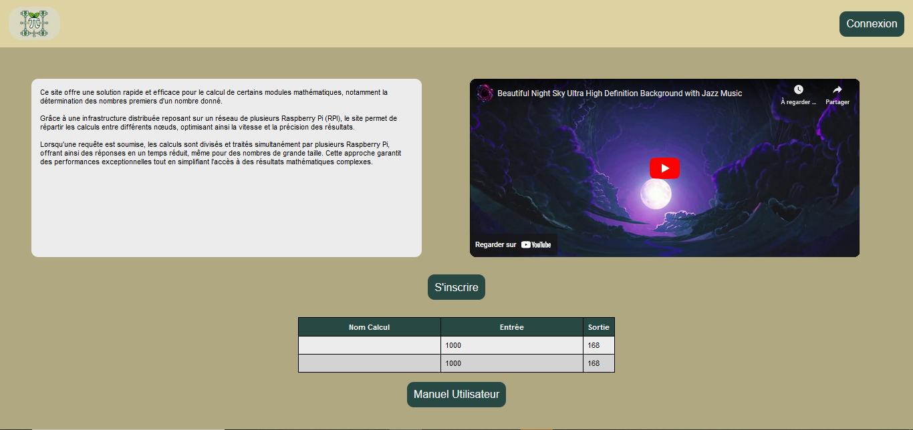
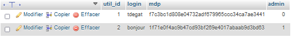

Assia GOUABI, Enzo Guignolle, Maaz NORAT, Loan QUILLET, Pierre JAUFFRES, Teddy DEGAT 
INF3

# SAÉ S5 - Descriptif des fonctionnalités implémentées 
## Site dynamique 

  

       

## Plan
- ### [I - Introduction](#I)
- ### [II - Structure du site dynamique](#II)
- ### [III - Structure de la base de données](#III)

   

----------

   

## I - Introduction

Le document suivant a pour but de decrire la structure des pages du site dynamique, d'expliquer leur fonctionnement et leur intérêt mais également d'expliquer la structure de la base de données. 

 

## II - Structure du site dynamique

### But du site 

L’objectif principal de cette application est de retranscrire de manière visuelle et rapide les résultats des calculs réalisés sur un Raspberry Pi (RPI) en utilisant un site dynamique. Cette plateforme permet à ses utilisateurs de tester et de réaliser des calculs sur différents modules, tels que le module des Nombres Premiers ou celui de Monte Carlo, en offrant une interface intuitive et un accès direct aux résultats.

L'application est conçue pour simplifier l'interaction avec les calculs complexes en offrant un environnement graphique et accessible. Elle permet aux utilisateurs de tester ces modules en fournissant des paramètres et en affichant les résultats de manière claire. Les calculs sont effectués directement sur le RPI, et les résultats sont récupérés en temps réel et présentés de manière visuelle sur le site.

### Les pages du site dynamique

Le site dynamique comprend plusieurs pages inspirées des maquettes et du site statique réalisé. 

### Page d'accueil

La page d'accueil est accessible à toute personne visitant la plateforme, contrairement aux autres pages qui requièrent une connexion.

Cette page sert à initier l'utilisateur à l'univers du site, en lui présentant les fonctionnalités disponibles et les attentes via une description générale et une vidéo de présentation.
Nous pouvons également visualiser les 10 derniers calculs et leurs résultats dans un tableau, un élément visuel particulièrement utile pour comparer différents résultats. 

Enfin, la page d'accueil inclut des boutons identifiables pour permettre à l'utilisateur de se connecter ou de s'inscrire sur la plateforme.

### Page de connexion

La page de connexion est un élément clé du site, car elle donne accès à l'ensemble des pages, à l'exception de la page d'accueil. En effet, l'accès aux autres sections du site est restreint tant que l'utilisateur n'est pas connecté. L'utilisateur doit renseigner son login et mot de passe. Ses données seront vérifiées si elles sont bien présentes dans la base de données. 
Cette page permet également à l'utilisateur de s'inscrire à la plateforme à l'aide d'un lien cliquable s'il ne l'a pas encore fait.

### Page d'inscription 

La page d'inscription permet à l'utilisateur de s'enregistrer sur la plateforme en fournissant des informations telles que le login, le prénom, le nom, le mot de passe, la confirmation du mot de passe et l'adresse email. Le mot de passe sera stocké dans la base de données sous forme hachée. Ces données seront enregistrées dans la base de données si elles sont valides et conformes. Il est également possible de se connecter directement via un lien si l'utilisateur possède déjà un compte.

### Page de profil

La page de profil permet d'accéder aux informations personnelles de l'utilisateur, avec la possibilité de modifier son mot de passe.

Comme sur la page d'accueil, il est possible de consulter les calculs et résultats des modules.

De plus, la barre de navigation permet de se déplacer facilement entre les différentes pages et de se déconnecter de la plateforme.

### Page modification mot de passe 

Cette page permet de modifier le mot de passe actuel de l'utilisateur, comme son nom l'indique. Pour cela, l'utilisateur doit saisir son mot de passe actuel, puis entrer et confirmer son nouveau mot de passe. Dans la base de données, l'ancien mot de passe est remplacé par le nouveau mot de passe, après avoir été haché.

### Page de module 

La page Module est la page principale de l'application, permettant de tester facilement les modules Prime, qui génèrent les nombres premiers à partir d'un nombre donné, ainsi que le module Monte Carlo. Elle présente un tableau affichant le résultat du calcul, le temps qu'il a fallu pour l'exécuter, ainsi que le nombre de processeurs utilisés pour les modules. 

L'utilisateur peut accéder à son profil, revenir à la page d'accueil ou consulter les courbes de tests de performances, illustrant la scalabilité forte et faible des modules, avec un graphique du speedup en fonction du nombre de points ou de processus.

Pour tester le module "Nombres Premiers", il suffit d'entrer le nombre dont on souhaite obtenir les premiers nombres premiers, ainsi que le nombre de workers qui effectueront ce calcul. Le résultat affiché indiquera le nombre de nombres premiers trouvés, le nombre de travailleurs qui se sont répartis le travail, ainsi que le temps qu'ils ont mis.

Pour tester le module "Monte Carlo", il faut entrer le nombre de points à utiliser, puis spécifier également le nombre de workers chargés du calcul. Le résultat obtenu correspond à l'erreur par rapport à PI, au nombre de travailleurs impliqués et au temps qu'ils ont mis.

### Page Administration 

La page Administration permet simplement d'avoir un aperçu du stockage disponible sur le RPI et de visualiser si les rpi0 sont connectés ou déconnectés. 
On peut consulter les pages modules et profil. 

L'administrateur web a pour login : **bonjour** et pour mot de passe **bonjour**

## III - Structure de la base de données

La base de données s'appelle "GestionCalculs" et contient toutes les informations relatives aux utilisateurs, programmes et calculs. Elle se compose de trois tables. La table des utilisateurs recense l'ensemble des personnes inscrites sur la plateforme. Elle inclut un identifiant unique pour chaque utilisateur (clé primaire), le login, le mot de passe haché, ainsi qu'un champ booléen qui précise si un utilisateur a le rôle d'administrateur (0 si l'utilisateur n'est pas admin, 1 s'il l'est).

La table "Programmes" utilise l'identifiant du programme (prog_id) comme clé primaire. Elle contient également le nom du programme (par exemple, "Monte Carlo" ou "Nombres Premiers") et un champ supplémentaire, chemin_acces, qui spécifie le chemin d'accès aux fichiers nécessaires pour exécuter les modules Monte Carlo et Nombres Premiers.

Enfin, la table "Calculs" possède un identifiant unique calc_id comme clé primaire. Util_id  correspond à l'identifiant de l'utilisateur ayant effectué le calcul (clé étrangère faisant référence à la table "Utilisateurs"). Elle inclut également un champ epingle, qui n'a pas été implémenté mais qui aurait permis de marquer un calcul comme épinglé (0 pour non, 1 pour oui). Les champs entree et sortie enregistrent respectivement les données d'entrée et le résultat de l'exécution du module. Enfin, la table contient les champs tps_calcul, qui représente le temps d'exécution du calcul, et date, qui indique la date à laquelle le calcul a été réalisé.

Cette base de données est simple et logique, car elle couvre les éléments essentiels de l'application : l'inscription des utilisateurs et l'exécution des calculs des modules.

 

